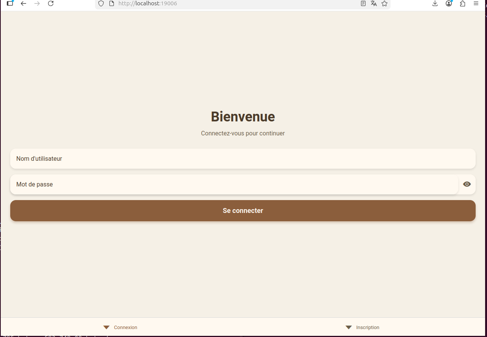
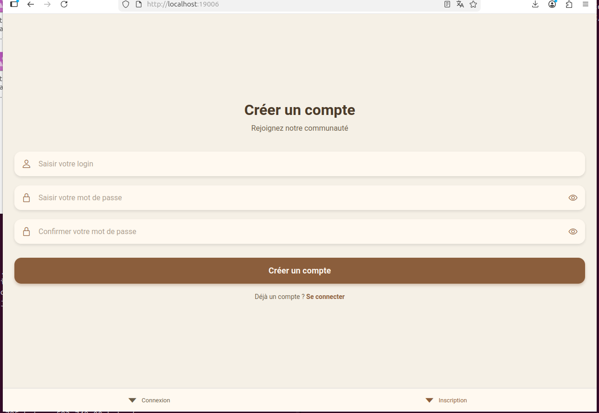
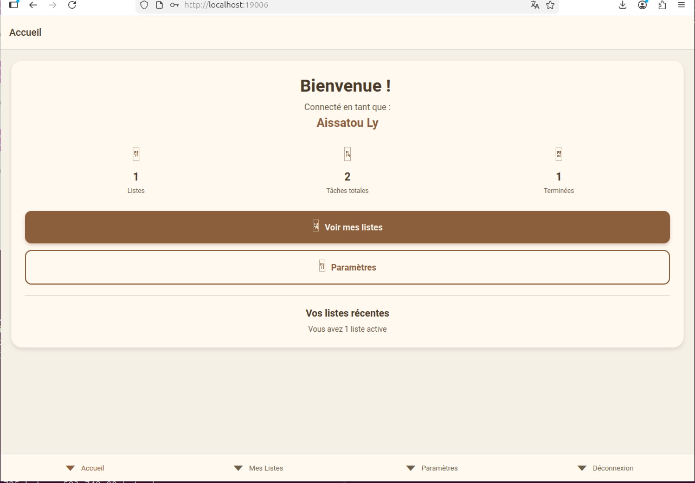
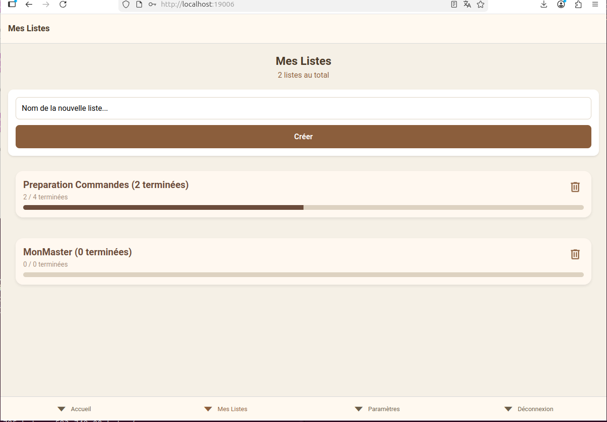
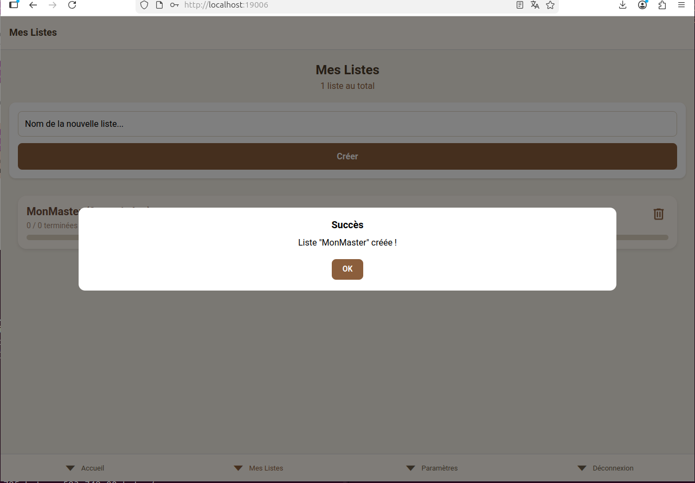
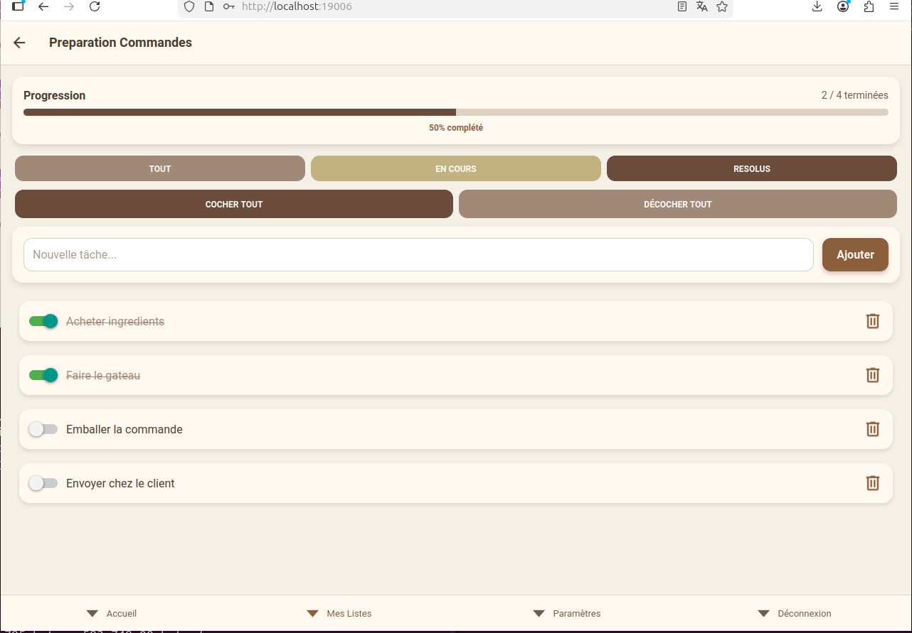
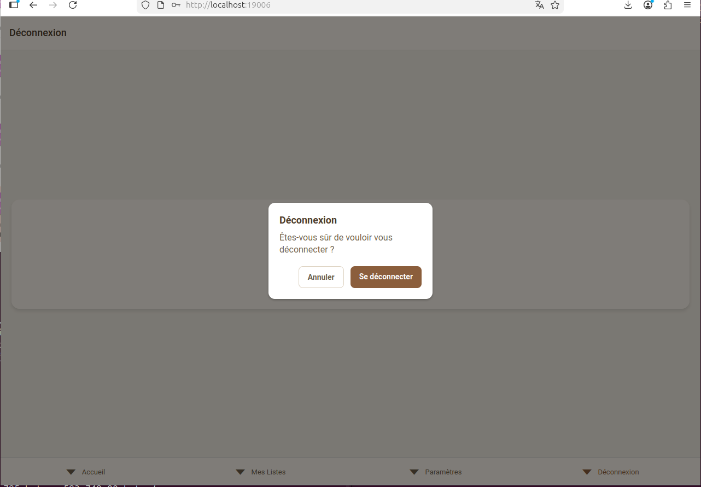
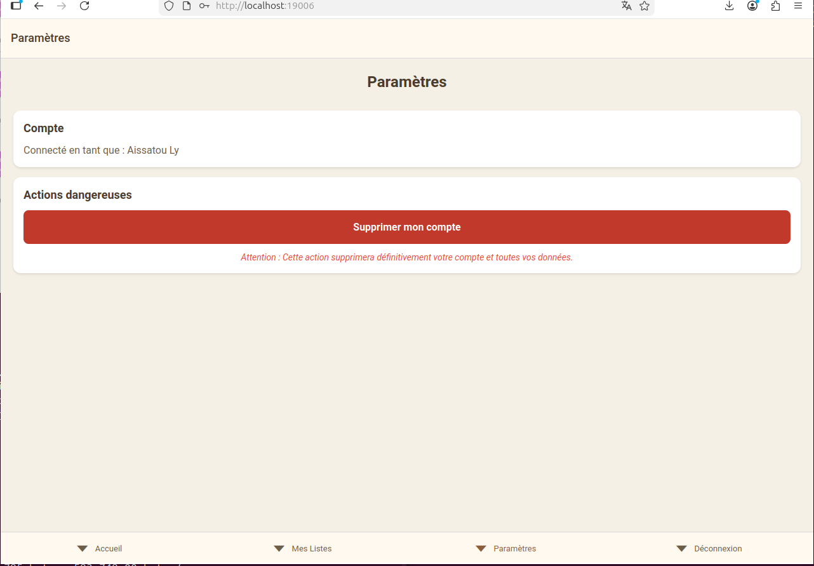

#TodoList App

Application de gestion de tâches,développée avec React Native dans le cadre de ma licence en informatique.

## Aperçu
### Connexion


### Création de compte


### Accueil


### Mes Listes


### Création de liste


### Détails d'une liste


### Déconnexion


### Suppression de compte



## Fonctionnalités
- Authentification : connexion, inscription et déconnexion sécurisées.
- Gestion des listes : création et suppression de listes de tâches.
- Gestion des tâches : ajout, suppression et changement d'état (fait / à faire).
- Barre de progression par liste avec pourcentage de complétion.
- Filtrage des tâches : tout / en cours / résolues.
- Actions en masse : cocher ou décocher toutes les tâches.
- Paramètres : suppression définitive du compte.
- Modales de confirmation pour les actions sensibles.


## Technologies
- React Native + Expo
- React Navigation (Stack Navigator + Bottom Tab Navigator)
- GraphQL via fetch natif
- Context API pour la gestion d'état global (token, username)
- Authentification par token JWT

## Installation
```bash
# Installer les dépendances
npm install

# Lancer l'application
npx expo start
```

> L'application se connecte à un serveur GraphQL. 
> L'URL de l'API est configurée dans `Api/apiUrl.js`.

## Structure du projet
- **App.js**
- **Navigation/** — Stack et Tab navigators
- **screen/** — Écrans de l'application
- **components/** — Composants réutilisables (UI)
- **Api/** — Appels GraphQL
- **Context/** — Contextes React (token, username)
- **assets/** — Images et icônes
