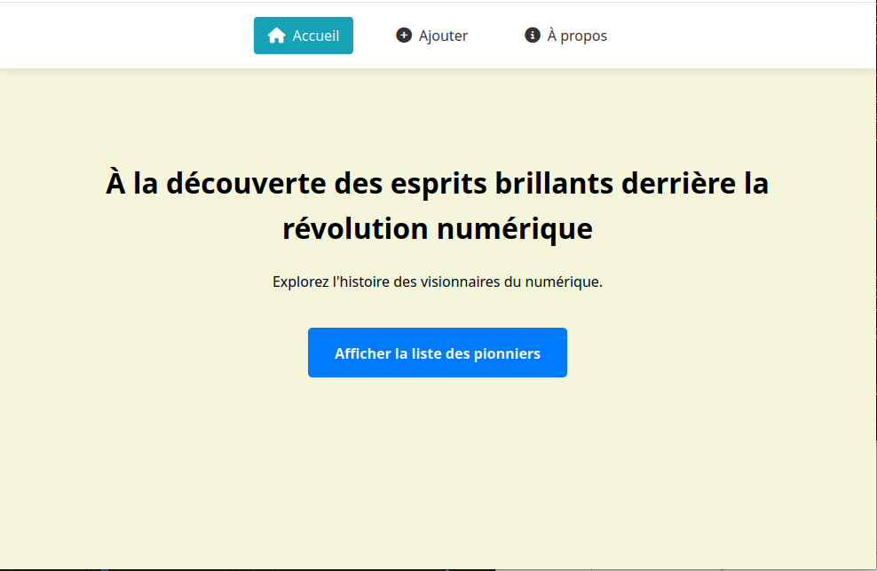
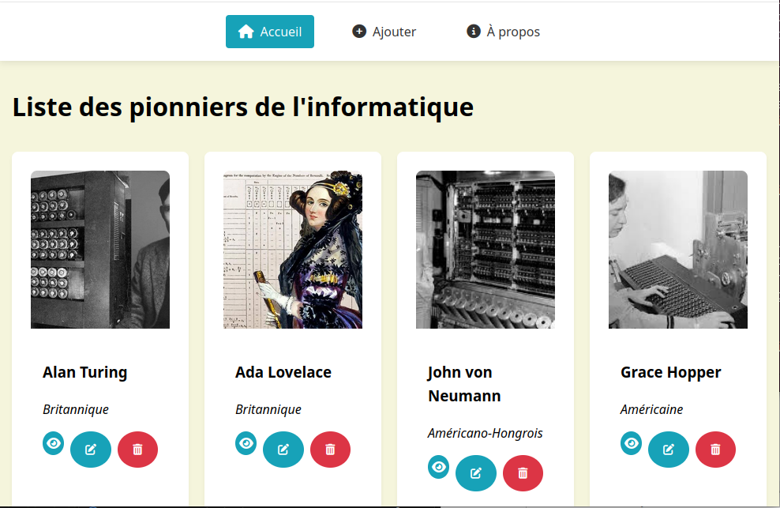
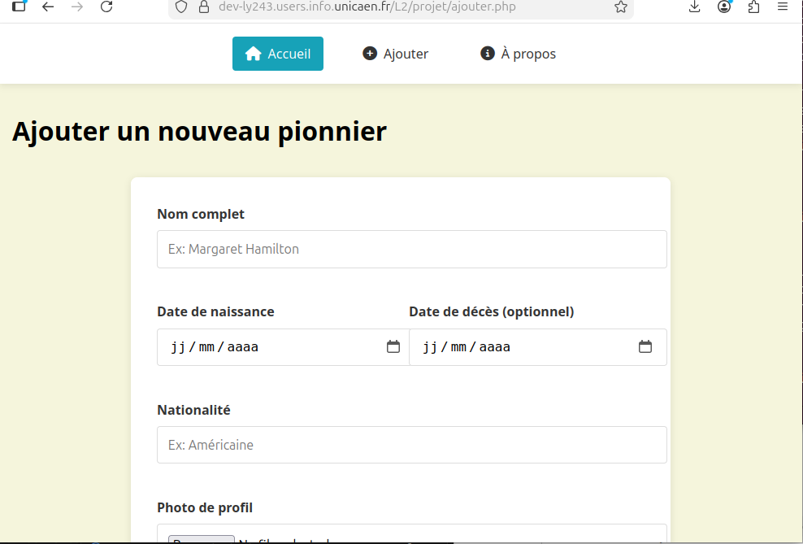
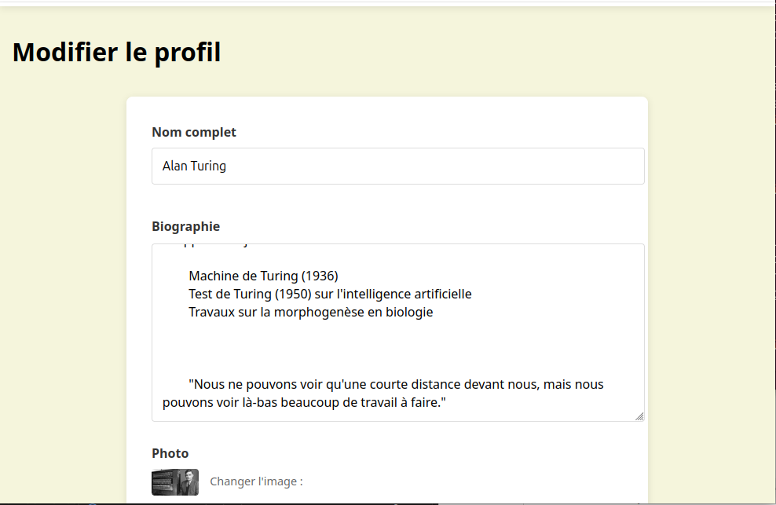
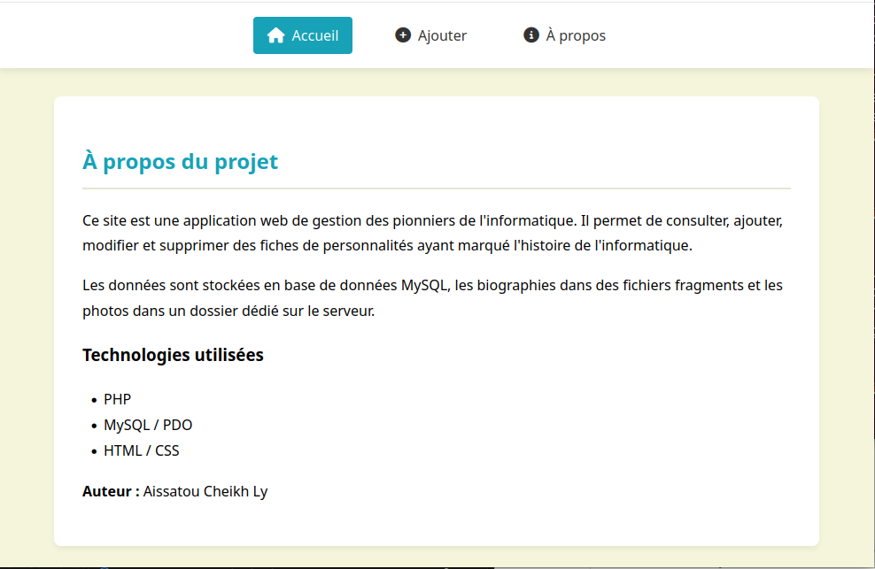

# Pionniers de l'Informatique
Application web de recensement et valorisation des figures marquantes de l'histoire de l'informatique — de Ada Lovelace à Grace Hopper, en passant par Alan Turing et John von Neumann.

---

## Fonctionnalités
- **Catalogue visuel** — navigation intuitive en grille avec photo, nom et nationalité.
- **Fiches détaillées** — biographie complète, dates de naissance et de décès, nationalité et photo pour chaque pionnier.
- **Ajout de pionniers** — formulaire complet avec upload de photo et saisie de biographie:
- **Modification** — édition du nom, de la biographie et remplacement de photo (l'ancienne est automatiquement supprimée du serveur):
- **Suppression** — suppression complète avec nettoyage automatique des fichiers associés (image + fragment texte):
- **Persistance hybride** — les données sont stockées en base MySQL, les biographies dans des fichiers fragments `.frg.html` et les photos dans un dossier dédié:

---

## Aperçu

### Page d'accueil

### Liste des pionniers

### Ajout d'un pionnier

### Modifier un pionnier

### Suppression

### À propos

---

## Technologies
- PHP / PDO
- MySQL
- HTML / CSS
- Font Awesome

---

## Configuration
Copier `configExemple.php` en `config.php` et renseigner les identifiants de connexion à la base de données, puis importer `Pionnier.sql`.

